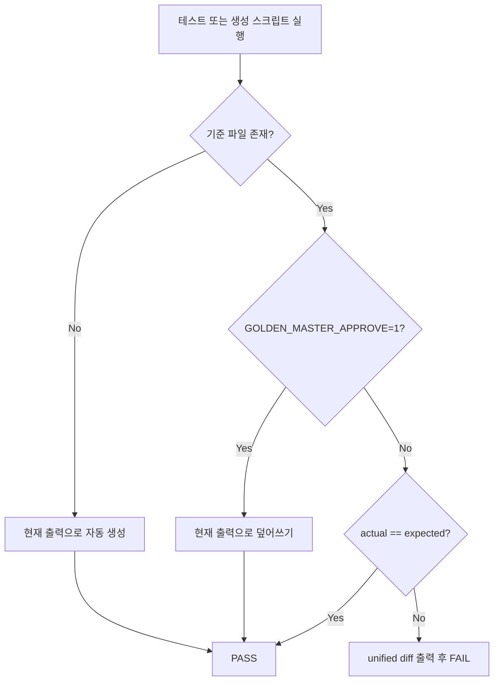

# Golden Master Approval Pattern — GM-1

Magic Square Solver의 **실제 출력**을 기준선(baseline)으로 고정하고, 회귀 시 `actual`과 `expected`를 비교하는 Approval / Golden Master 패턴 설계 문서입니다.

---

## 1. 목적

| 항목 | 내용 |
|------|------|
| **ID** | GM-1 |
| **대상** | `MagicSquareControl.solve()` 전체 파이프라인 (Boundary → Control) |
| **캡처 형식** | Result DTO 직렬화 (`list[int]` 성공 / `ErrorResponse.code` 실패) |
| **기준 파일** | `tests/golden_master_expected.txt` |
| **회귀 테스트** | `tests/integration/test_golden_master_solve.py` |

Solver 출력 계약이 바뀌면 테스트가 **FAIL**하고 unified diff로 차이를 보여 줍니다.

---

## 2. 시나리오 (5건)

| Section ID | Fixture | 기대 결과 |
|------------|---------|-----------|
| `normal_success` | `grid_g2_small_first_success()` | small-first 성공 `int[6]` |
| `reverse_success` | `grid_g3_reverse_success()` | reverse 성공 `int[6]` |
| `invalid_blank_count` | `grid_three_blanks()` | `ERR_INVALID_BLANK_COUNT` |
| `duplicate_number` | `grid_duplicate_seven_with_two_blanks()` | `ERR_DUPLICATE_VALUE` |
| `no_valid_solution` | `grid_no_solution()` | `ERR_SOLVER_NO_SOLUTION` |

모든 시나리오는 `tests/conftest.py`의 공유 격자 fixture를 재사용합니다.

---

## 3. 기준 파일 구조

섹션은 `[section_id]` 헤더로 구분하고, 섹션 사이는 구분선 `________________________________________`로 연결합니다.

### 성공 시나리오

```text
[normal_success]
Input:
16 3 2 13
5 10 11 8
9 0 0 12
4 15 14 1
Output:
[3, 2, 6, 3, 3, 7]
```

### 오류 시나리오

```text
[invalid_blank_count]
Input:
0 2 3 4
5 0 7 8
9 10 0 12
13 14 15 16
Error:
ERR_INVALID_BLANK_COUNT
```

오류 섹션은 **코드만** 기록합니다 (`message`, `layer`는 Golden Master 범위 밖).

---

## 4. Approve 패턴 동작



### 4.1 기준 파일 없음

`assert_golden_master_matches()` 호출 시 `tests/golden_master_expected.txt`가 없으면 **현재 솔버 출력**을 기준으로 파일을 자동 생성합니다.

### 4.2 기준 파일 있음

현재 출력으로 전체 문서를 빌드한 뒤, committed baseline과 **문자열 전체 비교**합니다.

### 4.3 불일치

`difflib.unified_diff`로 expected vs actual diff를 assertion 메시지에 포함하고 **FAIL**합니다.

### 4.4 의도적 갱신 (Approve)

다음 중 하나로 baseline을 갱신합니다.

```powershell
# 환경 변수
$env:GOLDEN_MASTER_APPROVE = "1"
pytest tests/integration/test_golden_master_solve.py

# 생성 스크립트 (권장)
python scripts/generate_golden_master.py
git add tests/golden_master_expected.txt
```

---

## 5. 모듈 구성

| 경로 | 역할 |
|------|------|
| `tests/golden_master/scenarios.py` | 5개 시나리오 정의 |
| `tests/golden_master/approval.py` | 직렬화, diff, approve 로직 |
| `tests/integration/test_golden_master_solve.py` | GM-1 회귀 테스트 |
| `scripts/generate_golden_master.py` | 기준 파일 생성/갱신 CLI |
| `tests/golden_master_expected.txt` | committed baseline |

### 캡처 지점

```text
MagicSquareControl(BoundaryValidator(), MagicSquareDomainResolver()).solve(grid)
```

- **성공**: `list[int]` → `Output:` 블록
- **실패**: `ErrorResponse` → `Error:` 블록 (code만)

GUI `stdout`(`Success: [...]`)과의 parity가 필요하면 `MagicSquareScreenPresenter.format_success_message()`를 별도 Golden Master 스위트로 확장할 수 있습니다. GM-1은 **DTO 계약**을 기준으로 합니다.

---

## 6. 테스트 ID

| Test ID | 검증 내용 |
|---------|-----------|
| `test_gm_01_full_document_matches_baseline` | 전체 문서 일치 |
| `test_gm_02_each_section_present_in_baseline` | 섹션별 개별 일치 (parametrize) |

---

## 7. 운영 가이드

1. 솔버/포맷 변경 후 `pytest tests/integration/test_golden_master_solve.py` 실행
2. FAIL 시 diff 확인 → 의도된 변경이면 `python scripts/generate_golden_master.py`
3. `git add tests/golden_master_expected.txt` 후 커밋
4. CI에서는 `GOLDEN_MASTER_APPROVE` 없이 비교만 수행 (자동 갱신 금지)

---

## 8. 제약 및 확장

- **In scope**: 5개 고정 시나리오, DTO 직렬화, approve/regression
- **Out of scope (GM-1)**: GUI stdout, n×n 일반화, snapshot 플러그인(syrupy 등) 도입
- **확장**: 새 시나리오는 `GOLDEN_SCENARIOS`에 추가 후 `generate_golden_master.py` 재실행

---

*문서 버전: GM-1 / GM-2 / MagicSquare_JH*

---

## 9. GM-2 테스트 코드

| 항목 | 내용 |
|------|------|
| **ID** | GM-2 |
| **테스트 파일** | `tests/integration/test_golden_master_magic_square.py` |
| **마커** | `@pytest.mark.golden_master` / `[TAG][GoldenMaster]` |
| **실행** | `pytest -m golden_master -v` |
| **계약 검증** | `tests/golden_master/contracts.py` |

### GM-TC 매핑

| Test Case | Section | 검증 |
|-----------|---------|------|
| GM-TC-01 | 정상 조합 성공 | int[6], 1-index, row-major, small-first |
| GM-TC-02 | reverse 조합 성공 | int[6], 1-index, row-major, reverse fallback |
| GM-TC-03 | INVALID_BLANK_COUNT | ErrorResponse, Boundary layer |
| GM-TC-04 | DUPLICATE_NUMBER | ErrorResponse, Boundary layer |
| GM-TC-05 | NO_VALID_MAGIC_SQUARE | ErrorResponse, Control layer |

### 실행 결과 예시

```text
$ pytest -m golden_master -v
tests/integration/test_golden_master_magic_square.py::TestGoldenMasterMagicSquare::test_golden_master_section_matches_baseline[normal_success] PASSED
tests/integration/test_golden_master_magic_square.py::TestGoldenMasterMagicSquare::test_golden_master_output_contract[normal_success] PASSED
...
tests/integration/test_golden_master_solve.py::TestGoldenMasterSolveScenarios::test_gm_01_full_document_matches_baseline PASSED
======================== 18 passed ========================
```

### 실패 시 diff 형식

```text
--- expected
+++ actual
@@ -1,4 +1,4 @@
 Input:
 ...
-Output:
+[3, 2, 6, 3, 3, 8]
```

